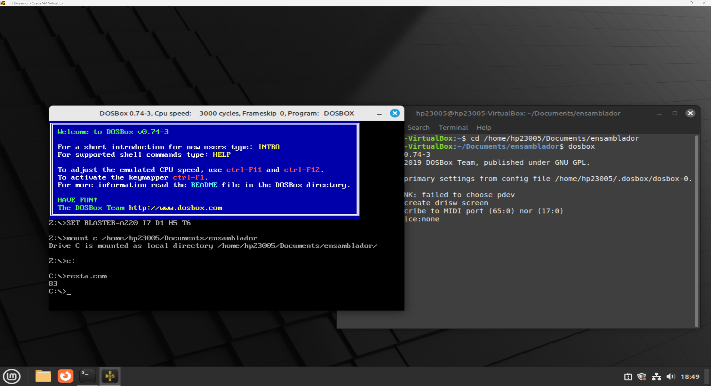
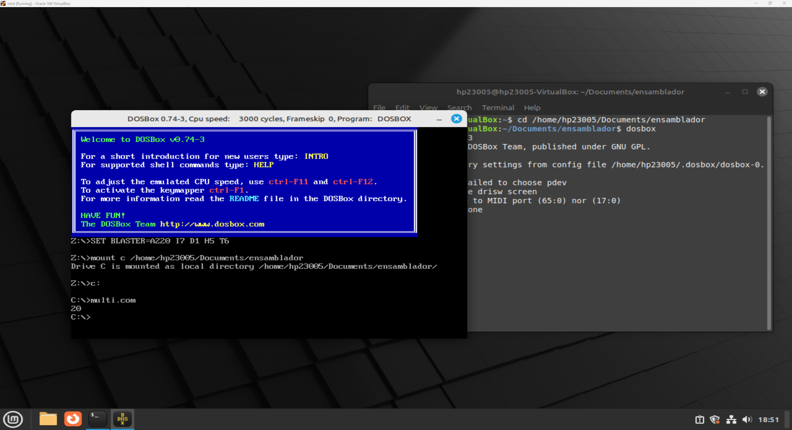
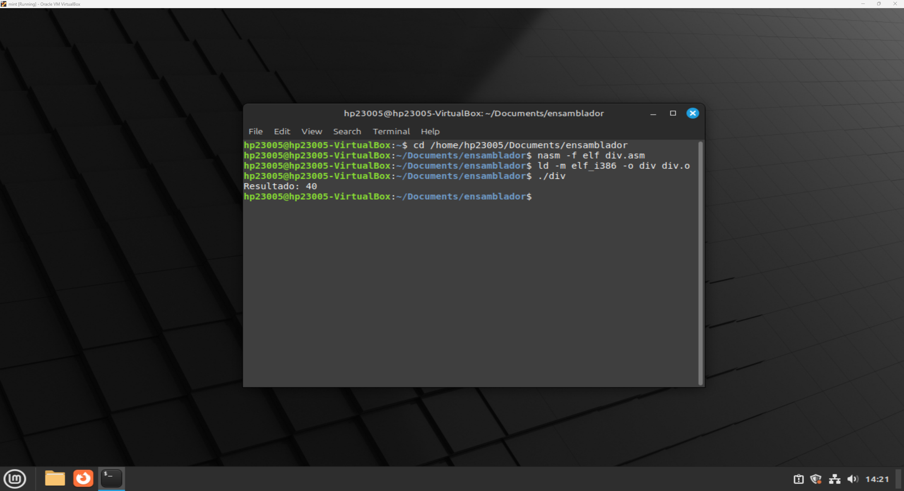

# Portafolio HP23005 - DEC

## 📁 Contenido

### 🔹 1. `resta.asm`
- **Descripción:** Resta tres números usando registros de 16 bits.
- **Propósito:** Mostrar el resultado final usando rutinas para conversión ASCII.
- **Entorno:** DOS real (formato `.COM`), ejecutado con DOSBox.

---

### 🔹 2. `multiplicacion.asm`
- **Descripción:** Multiplica dos números de 8 bits y convierte el resultado a ASCII.
- **Propósito:** Demostrar cómo realizar una multiplicación y mostrar el resultado en pantalla.
- **Entorno:** DOS real (formato `.COM`), ejecutado con **DOSBox**.

---

### 🔹 3. `division.asm`
- **Descripción:** Divide dos números de 32 bits y convierte el resultado a ASCII.
- **Propósito:** Ejecutar operaciones en modo protegido Linux, usando llamadas al sistema para imprimir el mensaje y el resultado.
- **Entorno:** Linux (formato ELF de 32 bits).

---

## ⚙️ Instalación y ejecución

### 🔸 Instalación de DOSBox
```bash
# En la terminal de linux
sudo apt install dosbox
```

#### 💻 Compilación 'resta.asm'
```bash
# En la terminal de linux
nasm -f bin resta.asm -o resta.com

# Ejecucion de DOSBox en la terminal de linux
dosbox 

# En la terminal de DOSBox
# Reemplazar la ruta de acuerdo a donde se tengan los archivos
mount c /home/hp23005/Documents/ensamblador
C:
resta.com
```

#### 💻 Compilación 'multiplicacion.asm'
```bash
# En la terminal de linux
nasm -f bin multiplicacion.asm -o multiplicacion.com

# Ejecucion de DOSBox en la terminal de linux
dosbox 

# En la terminal de DOSBox
# Reemplazar la ruta de acuerdo a donde se tengan los archivos
mount c /home/hp23005/Documents/ensamblador
C:
multiplicacion.com
```

#### 💻 Compilación 'division.asm'
```bash
# En la terminal de linux
nasm -f elf division.asm
ld -m elf_i386 -o div division.o
./division
```
